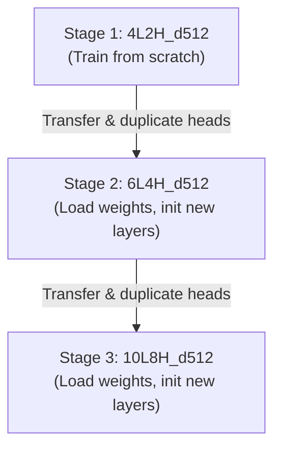

# Specification: Stage 2.7 – Progressive High-Capacity Scaling Ladder

This track specifies the progressive layer-expansion and head-duplication strategy to scale CodonLM to high capacity (`d_embd = 512`) under laptop hardware constraints.

---

## 1. Architecture Comparison: 10L8H vs. 8L10H

When scaling a model with `d_embd = 512`, we compare two configurations: **10L8H** (10 Layers, 8 Heads) vs. **8L10H** (8 Layers, 10 Heads).

### A. Mathematical Divisibility Constraint
* In multi-head attention, the embedding space is partitioned across heads. Therefore, the embedding dimension ($d_{\text{embd}}$) **must be divisible** by the number of heads ($n_{\text{head}}$) to produce an integer head dimension:
  $$d_{\text{head}} = \frac{d_{\text{embd}}}{n_{\text{head}}}$$
* For **10L8H** ($n_{\text{head}} = 8$):
  $$d_{\text{head}} = \frac{512}{8} = 64 \quad \text{(Valid integer, matches hardware standard)}$$
* For **8L10H** ($n_{\text{head}} = 10$):
  $$d_{\text{head}} = \frac{512}{10} = 51.2 \quad \text{(Invalid fractional dimension, causes runtime error)}$$
* To use 10 heads, the embedding dimension would have to be changed to a multiple of 10 (e.g., $d_{\text{embd}} = 500$ or $d_{\text{embd}} = 640$), which would break standard powers-of-two alignment optimized for GPU memory alignment.

### B. Depth vs. Breadth Representation
Even if we aligned the dimensions (e.g., comparing $10\text{L}$ with $8\text{L}$):
* **Compositional Depth (`10L`)**: Genomic sequence features are hierarchically nested (nucleotides $\rightarrow$ codons $\rightarrow$ motifs/structures $\rightarrow$ ORFs $\rightarrow$ operons). Deeper layers compose these features sequentially, enabling higher-level representations.
* **Attention Breadth (`n_head`)**: More heads allow the model to attend to more positions simultaneously at the *same* abstraction level. However, after 8 heads, the returns diminish significantly for standard genomic contexts.
* **Conclusion**: **10L8H** is mathematically valid and representationally superior for capturing genomic hierarchical abstractions.

---

## 2. Progressive Ladder Flow

The training pipeline uses progressive weight transfer:

### Head Duplication Formula
When scaling from $h_1$ heads to $h_2$ heads (e.g., 2 $\rightarrow$ 4):
$$\mathbf{W}_q^{(new)} = \left[ \mathbf{W}_q^{(old)}, \mathbf{W}_q^{(old)} \right]$$
This duplicates the query, key, and value projection matrices along the head dimension, ensuring the model starts with the exact same attention outputs, which then specialize during fine-tuning.
