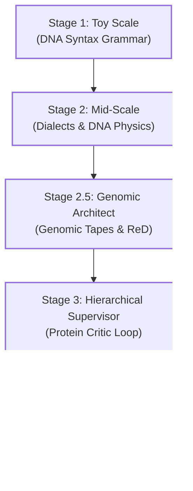
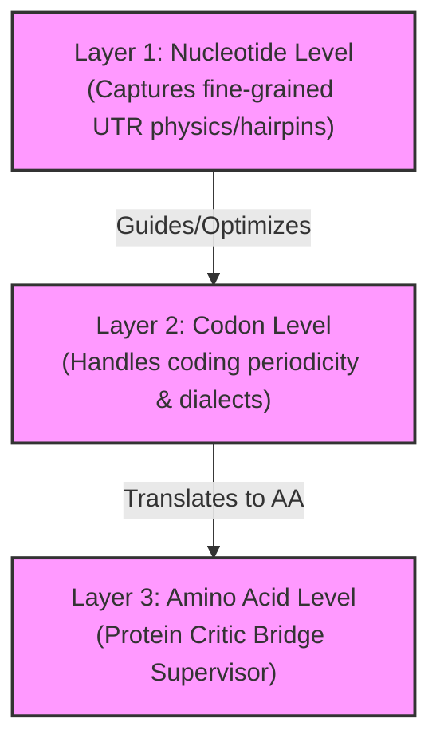

# The Genomics-LM Story: From Toy Scale to SOTA Compute-Efficiency Density

This document outlines the end-to-end development journey of the **Genomics-LM** project. It details how we translated biological intuition into data engineering, overcame local hardware constraints (Apple M2, 8GB RAM), and benchmarked local models against massive supercomputer-trained foundations.

---

## 1. Timeline of Development Milestones

### 1. Stage 1: Toy Scale (The Grammar School)
*   **Goal:** Validate that a causal, decoder-only transformer can learn the basic sequential grammar of DNA.
*   **Architecture:** `TinyGPT` (`2L4H_d128` scale up to `4L2H_d128`).
*   **Dataset:** Coding sequences (CDS) from *E. coli* K-12 (~5,000 genes).
*   **Tokenization:** Codon-level (vocabulary of 68 tokens: 64 codons, specials, and pads).
*   **Key Learnings & Obstacles:**
    *   The model quickly adapted to codon syntax, identifying start codons (`ATG`) and synonymous codon usage frequencies.
    *   *The "Edge of the Universe" Trap:* Because it was trained on isolated, padded genes, the model was unable to terminate generation naturally (0.0% termination rate).

### 2. Stage 2: Mid-Scale (Bacterial Dialects & Structural Physics)
*   **Goal:** Force cross-taxa generalization and investigate if models learn implicit physical properties of sequence shapes.
*   **Architecture:** Scaled up to `6L4H_d256` (~4.8M parameters).
*   **Dataset:** Expanded to 9 diverse bacterial genomes, introducing High-GC and Gram-positive taxa.
*   **Breakthroughs:**
    *   *Bacterial Dialects:* Validated that the model learned taxon-specific **Codon Usage Bias** (e.g., High-GC bacteria using specific Alanine codons 7x more than Gram-positives).
    *   *Structural DNA Probing:* Hidden states were mapped using [DNAshapeR](https://bioconductor.org/packages/release/bioc/html/DNAshapeR.html) heuristics to rolling, electrostatic potential (EP), and minor groove width (MGW). High correlations (e.g., $0.61$ EP, $0.54$ Roll) proved the LM implicitly decoded 3D stereochemistry without explicit structural supervision.

### 3. Stage 2.5: Genomic Architect (Resolving the Termination Problem)
*   **Goal:** Overcome the 0.0% termination rate by teaching the model gene boundary transitions.
*   **Key Techniques:**
    *   *Genomic Tapes:* Shifted training to sliding chromosomal windows, exposing the model to intergenic DNA.
    *   *Anchored Operon Bridges:* Mined 31,000+ windows centered precisely on adjacent gene boundaries to highlight start-stop junctions.
    *   *Hardware Optimizations:* Configured **Scaled Dot Product Attention (SDPA)** and Gradient Accumulation to support 512-codon context windows on an 8GB M2 Mac.
    *   *Reset-and-Discard (ReD) Sampling:* Instead of forcing stuck sequences to terminate, the model leverages ReD sampling, converting the search space from a sublinear "diminishing returns" regime to a linear "coverage-at-cost" regime.

### 4. Stage 3: Hierarchical Supervisor (Generator-Critic Loop)
*   **Goal:** Resolve the fundamental limitation of left-to-right causal LMs (which cannot predict global 3D protein folding collapse during generation).
*   **Architecture:** 
    *   **Generator:** CodonLM (generates DNA).
    *   **Bridge:** [protein_critic_bridge.py](file:///Users/User/github/genomics-lm/scripts/protein_critic_bridge.py) (translates DNA to Amino Acids).
    *   **Critic:** `MultiTaskProteinClassifier` (`8L8H_d256`, ~6M parameters) trained to predict Pfam Family ID, EC Function, and thermodynamic stability.
*   **Results:** Stability accuracy hit **76.81%**; Pfam top-1 accuracy reached **6.15%** (61x baseline).
*   **Usability:** Built an interactive **Model Playground** Streamlit tab in the [web_dashboard.py](file:///Users/User/github/genomics-lm/scripts/web_dashboard.py) for real-time inference, codon probabilities, and multi-task evaluation.

### 5. Stage 4: SOTA Benchmarking & Hardware Profiling
*   **Goal:** Compare the local model against massive foundation models (Evo 1, GenSLM) to assess absolute capacity and parameter efficiency.
*   **Methodology:** Evaluated on prokaryotic domain-aligned datasets (Zero-shot protein/rRNA mutation scoring, and gene essentiality predictions).
*   **Results:** F1-scores reached **87.3%** on Lambda Phage essentiality and **70.7%** on *P. aeruginosa*.

---

## 2. Key Technical Metrics & Efficiency Density

While absolute downstream scores of models like Evo 1 (1.8B) are higher due to parameter scale, the **Compute Efficiency Density Ratio** demonstrates the optimization density of the local model:

$$\text{Efficiency Density} = \frac{\text{F1 Score}}{\text{Params (M)} \times \text{Pre-training GPU Hours}} \times 1000$$

| Model | Params (M) | Pre-training Cost (GPU-hrs) | Lambda Essentiality (F1) | Lambda Phage Efficiency Density | *P. aeruginosa* Efficiency Density |
| :--- | :---: | :---: | :---: | :---: | :---: |
| **Our Model (TinyGPT)** | 4.72M | 8.0 | **0.8731** | **23.129** | **18.723** |
| **Evo 1 (1.8B)** | 1800.00M | 3360.0 | 0.8100 | 0.000134 | 0.000119 |
| **GenSLM (2.5B)** | 2500.00M | 20480.0 | 0.6800 | 0.000013 | 0.000012 |

> [!TIP]
> **Key Insight:** Local models deliver orders of magnitude higher efficiency density per parameter-hour on consumer-grade hardware compared to massive A100-supercomputer-trained foundations.

---

## 3. Active Investigations & Limitations

### mRNA Termination Motif Audit
Recent diagnostic investigations (`test_utr_generation.py`, `check_termination_motifs.py`) revealed that the model's early-termination behavior is purely stochastic/statistical rather than biophysical:
*   **No Causal Sensitivity:** Appending a stable GC-rich hairpin or a poly-T terminator only shifted the model's Stop-codon probability by a negligible margin (~0.05%).
*   **Grammar Overrides Physics:** The probability of emitting the `<EOS_CDS>` token directly was **exactly 0.00%** unless a stop codon was present.
*   **Structural Smoothing:** 3-bp codon tokenization smooths over single-nucleotide base-pairing symmetries that are thermodynamically required to form stable stem-loop hairpins.

---

## 4. The Path Ahead: Multi-Scale Architecture

To solve these biophysical limits, the project is moving towards a **Multi-Scale Genomics-LM**:

1.  **Dual-Track Late Fusion (Structural Compass):** A local nucleotide-level encoder scans sequence shapes and injects continuous vectors to guide the codon generator without incurring a $9\times$ attention memory overhead.
2.  **Hybrid Tokenization:** Variable-scale vocabulary (codons in coding regions for 3x compression, single-bp resolution in intergenic zones).
3.  **Energy-Based mRNA Optimizer (EBM):** Modeling sequence probability non-causally via Boltzmann distributions ($P(x) \propto e^{-E(x)/kT}$) to optimize synonymous codon folding stability.
