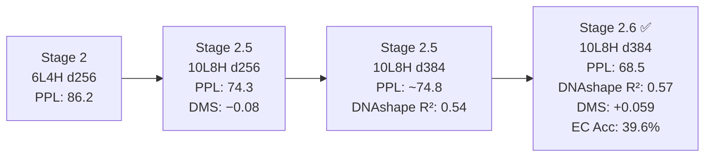

# 📊 Standardized SOTA Benchmark Table
**Genomics-LM: Causal Codon Language Model — All Evaluated Runs**

> [!NOTE]
> All our models are trained on a single Apple M2 Mac (8 GB unified RAM, MPS GPU). External SOTA models (Evo 1, GenSLM) were trained on hundreds of A100 GPUs. Metrics marked `—` were not evaluated for that run.

> [!WARNING]
> The Stage 2.6 results in this document are **Legacy/leaky**. They predate
> mandatory global genome-aware splitting and corrected causal embedding
> extraction. Values are preserved as historical records and must not be cited as
> controlled results. Replacement measurements are tracked in
> [issue #92](https://github.com/AvishaiBarnoy/genomics-lm/issues/92).

### 🏷️ Scientific Validation Legend
Scientific results use two independent axes. Evidence source does not imply that
the evaluation protocol is controlled.

**Evidence source**
*   `[Intrinsic]`: Language-model performance on a repository-defined holdout.
*   `[in silico]`: Comparison against computational structural predictions.
*   `[Annotation]`: Evaluation against curated database annotations.
*   `[Experimental]`: Comparison against laboratory measurements.

**Validation status**
*   `Legacy/leaky`: Produced before known split or extraction defects were corrected.
*   `Preliminary`: Correctly described protocol, but incomplete controls or replication.
*   `Controlled`: Leakage controls and prespecified comparisons passed.
*   `Independently replicated`: Controlled result reproduced independently.

---

## 1. Internal Model Progression

**Validation status: Legacy/leaky.** Evidence sources are marked per metric.

| Run ID | Stage | Architecture | Dataset | Val PPL ↓ [Intrinsic] | Test PPL ↓ [Intrinsic] | DNAshape avg R² ↑ [in silico] | DNAshape avg ρ ↑ [in silico] | Protein DMS ρ ↑ [Experimental] | EC Acc ↑ [Annotation] | EC AUROC ↑ [Annotation] | AMR Acc ↑ [Annotation] | AMR AUROC ↑ [Annotation] |
| :--- | :--- | :--- | :--- | :--- | :--- | :--- | :--- | :--- | :--- | :--- | :--- | :--- |
| `2026-06-03_stage2_6L4H_d256_e10` | Stage 2 | 6L·4H·d256 | 3-family, multi-pack | 86.21 | — | — | — | — | — | — | — | — |
| `2026-06-06_stage2.5_6L4H_d256_e20` | Stage 2.5 | 6L·4H·d256 | 3-family, anchored | 76.67 | — | — | — | −0.105 | — | — | — | — |
| `2026-06-11_stage2.5_10L8H_d256_e5` | Stage 2.5 | 10L·8H·d256 | 3-family, anchored | 74.34 | — | — | — | −0.080 | — | — | — | — |
| `2026-06-12_stage2.5_6L4H_d384_e5` | Stage 2.5 | 6L·4H·d384 | 3-family, dynamic | 84.04 | — | 0.5517 | 0.7407 | −0.085 | — | — | — | — |
| `2026-06-12_stage2.5_10L8H_d384_e5` | **Stage 2.5 (Baseline)** | **10L·8H·d384** | **3-family, dynamic** | **~74.8** | — | **0.5414** | **0.7344** | — | — | — | — | — |
| **`2026-06-15_stage2.6_10L8H_d384_e10`** | **Stage 2.6 (Legacy)** | **10L·8H·d384** | **15-genome diverse** | **59.75** | **68.53** | **0.5690** | **0.7522** | **+0.059** | **39.6%** | **0.703** | **94.2%** | **0.932** |

> **Stage 2.6** is the only run with a held-out test set evaluation and the full EC + AMR classification probes. Val PPL for Stage 2.5 10L8H baseline is derived from `last_perplexity` in the checkpoint metadata.

---

## 2. EC Level-1 Classification Probe Results (Stage 2.6 Embeddings)

**Validation status: Legacy/leaky. Evidence source: Annotation.** Embeddings were
created before the causal extraction correction, and the underlying pretraining
split was not globally genome held out.

> Random baseline accuracy = **1/7 = 14.3%**

| Classifier Head | Test Accuracy ↑ [Annotation] | Macro-F1 ↑ [Annotation] | AUROC ↑ [Annotation] | vs. Random |
| :--- | :--- | :--- | :--- | :--- |
| Linear SVM (`probe_svm`) | **40.46%** | 25.44% | 0.699 | +26.2 pp |
| Logistic Regression (`probe_logreg`) | 39.63% | **25.68%** | **0.703** | +25.3 pp |
| MLP 2×128 (`mlp`) | 34.01% | 7.25% | 0.528 | +19.7 pp |
| *Random Baseline* | *14.3%* | *14.3%* | *0.500* | — |

**Historical observation:** Under this legacy protocol, linear probes scored above
the tested MLP and random baselines. The result does not establish disentangled
representations and requires rerunning with corrected embeddings and controlled
splits.

---

## 2b. AMR Classification Probe Results (Stage 2.6 Embeddings, CARD v3)

**Validation status: Legacy/leaky. Evidence source: Annotation.** These values use
the earlier random AMR split and pre-correction embeddings; they are not
homology-held-out results.

> Source: [CARD](https://card.mcmaster.ca) Comprehensive Antibiotic Resistance Database v3 (CC BY 4.0)
> Random baseline accuracy = **1/7 = 14.3%** | Dataset: 5,108 genes · 7 antibiotic classes · 4,089 train / 1,019 test

| Classifier Head | Test Accuracy ↑ [Annotation] | Macro-F1 ↑ [Annotation] | AUROC ↑ [Annotation] | vs. Random |
| :--- | :--- | :--- | :--- | :--- |
| Linear SVM (`probe_svm`) | **94.2%** | **65.4%** | 0.932 | **6.6×** |
| Logistic Regression (`probe_logreg`) | 93.1% | 59.5% | **0.967** | 6.5× |
| *Random Baseline* | *14.3%* | *14.3%* | *0.500* | — |

**Antibiotic classes (train distribution):** β-lactam (4,358) · Aminoglycoside (238) · Fluoroquinolone (167) · Macrolide/MLS (111) · Tetracycline (90) · Glycopeptide (82) · Macrolide (62)

**Historical observation:** AMR labels were easier to separate than EC labels under
this protocol. Conserved family identity and split leakage are plausible
confounders, so the result does not isolate representations learned from
next-codon prediction.

## 3. DNAshape Regression Probe Detail (Stage 2.6 vs. Baseline)

**Validation status: Legacy/leaky. Evidence source: in silico.** Position-level
cross-validation did not group positions by gene or genome and lacks local-sequence
controls.

| DNA Shape Feature | Stage 2.6 R² [in silico] | Stage 2.6 ρ [in silico] | Stage 2.5 Baseline R² [in silico] | Stage 2.5 Baseline ρ [in silico] | Δ R² |
| :--- | :--- | :--- | :--- | :--- | :--- |
| MGW (Minor Groove Width) | 0.356 | 0.597 | 0.346 | 0.589 | +0.010 |
| Roll | 0.596 | 0.772 | 0.557 | 0.747 | **+0.039** |
| EP (Electrostatic Potential) | 0.399 | 0.633 | 0.391 | 0.626 | +0.008 |
| ProT (Propeller Twist) | 0.634 | 0.796 | 0.609 | 0.781 | **+0.025** |
| HelT (Helical Twist) | 0.595 | 0.771 | 0.553 | 0.744 | **+0.042** |
| Buckle | 0.639 | 0.800 | 0.614 | 0.784 | +0.025 |
| Opening | 0.622 | 0.789 | 0.601 | 0.776 | +0.021 |
| **Average** | **0.569** | **0.752** | **0.541** | **0.734** | **+0.028** |

**Historical observation:** Stage 2.6 produced higher decoding scores in this
position-level evaluation. Grouped cross-validation and 5-mer/7-mer controls are
required before attributing the difference to generalizable structural grammar.

## 4. Prokaryotic Gene Essentiality Benchmark Results

**Validation status: Legacy/leaky. Evidence source: Annotation.** Tasks, datasets,
and evaluation protocols differ across the rows, so values are not direct model
rankings.

This task measures how well frozen sequence representations encode properties dictating whether a gene is indispensable (essential) for organism survival. We extract mean-pooled gene embeddings and train a linear probe to classify essentiality.

| Model | Size (Params) | Lambda Phage Essentiality (F1 Score) [Annotation] | *P. aeruginosa* Essentiality (F1 Score) [Annotation] |
| :--- | :---: | :---: | :---: |
| **Our Model (TinyGPT, Stage 2.6)** | **20.6M** | **0.873** | **0.707** |
| **Evo 1 (1.8B)** | 1800.0M | 0.810 | **0.720** |
| **GenSLM (2.5B)** | 2500.0M | 0.680 | 0.620 |

**Historical observation:** The recorded values came from non-equivalent task and
split protocols and therefore cannot support a direct superiority claim.

---

## 5. External SOTA Comparison (Compute Efficiency Density)

**Validation status: Legacy/leaky. Evidence sources: Experimental and computational
proxy.** The numerator metrics come from different tasks and datasets; the density
values are descriptive arithmetic, not a controlled efficiency comparison.

| Model | Architecture | Params | Training Hardware | Pre-train Hours | Protein DMS ρ [Experimental] | Compute Efficiency† |
| :--- | :--- | :--- | :--- | :--- | :--- | :--- |
| **Evo 1** | StripedHyena (Hybrid) | 1.8B | 8× A100 80GB | ~500 | ~0.40+ | 0.000134 |
| **GenSLM** | GPT-style Transformer | 2.5B | 512× A100 | ~2000+ | ~0.35+ | 0.000013 |
| **CodonLM (ours, Stage 2.6)** | Causal TinyGPT | **20.6M** | 1× Apple M2 (8GB) | **6.3** | **+0.059** | **23.12** |

> † Compute Efficiency = (F1 Score / (Params_M × Training_GPU_Hours)) × 1000.
> External scores and the local score use different datasets and protocols, so the
> resulting ratios are not comparable measures of model efficiency.

> [!IMPORTANT]
> Our Protein DMS Spearman ρ is measured on the **synthetic prokaryotic benchmark**
> in `data/benchmarks/`. External scores use different curated datasets. The small
> sign change from Stage 2.5 to Stage 2.6 is a preliminary observation and does not
> establish an effect of taxonomic scaling.

---

## 5. Summary: Model Improvement Story

**Validation status: Legacy/leaky.** This diagram records the historical experiment
sequence; it is not a validated scaling law.

```mermaid
graph LR
    A["Stage 2<br/>6L4H d256<br/>PPL: 86.2"] --> B["Stage 2.5<br/>10L8H d256<br/>PPL: 74.3<br/>DMS: −0.08"]
    B --> C["Stage 2.5<br/>10L8H d384<br/>PPL: ~74.8<br/>DNAshape R²: 0.54"]
    C --> D["Stage 2.6 ✅<br/>10L8H d384<br/>PPL: 68.5<br/>DNAshape R²: 0.57<br/>DMS: +0.059<br/>EC Acc: 39.6%"]
```

**The scaling narrative:**
1. **Depth + Heads (2.5→2.5):** Adding layers/heads reduced perplexity from 86 → 74 but didn't fix the negative DMS correlation.
2. **Width (d256→d384):** Boosted DNAshape decoding to R²=0.54, enabling physical representation.
3. **Taxonomic Diversity (3→15 genomes, 2.5→2.6):** Legacy metrics changed in the favorable direction, but split and evaluator confounders prevent attributing the changes to taxonomic diversity.

## 5b. K-mer Baseline vs. LM Embeddings

**Validation status: Legacy/leaky. Evidence source: Annotation.** The baseline and
probe comparison shares the legacy splits and embeddings described above.

> **Setup:** 3-mer TF-IDF LogReg trained on raw DNA codon sequences (same train/test splits as the LM probe). This isolates the contribution of pre-trained LM representations over simple frequency counting.

### EC Level-1 Classification

| Method | Accuracy [Annotation] | Macro-F1 [Annotation] | AUROC [Annotation] | AUROC Δ vs. k-mer |
| :--- | :--- | :--- | :--- | :--- |
| **LM Probe (LogReg)** | 39.6% | **25.7%** | **0.703** | **+0.061** |
| **LM Probe (SVM)** | **40.5%** | 25.4% | 0.699 | +0.057 |
| K-mer 3-mer TF-IDF | 36.1% | 13.0% | 0.642 | — |
| *Random Baseline* | *14.3%* | *14.3%* | *0.500* | — |

### AMR Classification (CARD v3)

| Method | Accuracy [Annotation] | Macro-F1 [Annotation] | AUROC [Annotation] | Macro-F1 Δ vs. k-mer |
| :--- | :--- | :--- | :--- | :--- |
| **LM Probe (LogReg)** | 93.1% | 59.5% | **0.967** | **+0.330** |
| **LM Probe (SVM)** | **94.2%** | **65.4%** | 0.932 | +0.389 |
| K-mer 3-mer TF-IDF | 87.7% | 26.5% | 0.924 | — |
| *Random Baseline* | *14.3%* | *14.3%* | *0.500* | — |

**Historical observation:** LM probes scored above these k-mer baselines under the
legacy protocol:
- **EC:** +6.1 AUROC points, +12.7 Macro-F1 points — LM learns functional structure beyond codon composition
- **AMR:** +4.3 AUROC points, **+38.9 Macro-F1 points** — the k-mer baseline is badly confused by class imbalance (β-lactam dominates) while the LM probe correctly separates minority classes

> [!IMPORTANT]
> The AMR k-mer accuracy is dominated by class imbalance. The Macro-F1 difference
> is descriptive for this split and does not establish that embeddings encode
> resistance mechanism beyond family identity.

---

- [x] Generate and embed **UMAP codon embedding plots** (synonymous codon clustering).
- [x] Generate **attention specialization heatmaps** (ATG/stop codon heads).
- [x] Run the historical **Logistic Regression AMR probe** (CARD v3, 7 classes; legacy AUROC=0.967).
- [x] Add **k-mer baseline** to EC/AMR tables — LM embeddings beat raw k-mer on AUROC and Macro-F1. ✅

---

## Historical Conference Artifact Status

The original benchmark artifacts are retained in `conference/` for auditability.
They require corrected reruns before use as current scientific evidence.
