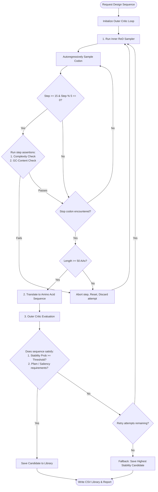

# Generative Design Loop Recap

This document provides a detailed architectural blueprint of the `genomics-lm` sequence design loop, outlining the interaction between the Causal Codon Generator, the step-wise Active ReD assertions, and the MultiTask ProteinCritic.

---

## 1. Flowchart Overview

---

## 2. Phase-by-Phase Execution

### Phase 1: Inner Active ReD Sampling (Syntactic Validation)
*   **Autoregressive Codon Sampling**: The causal `CodonLM` generates codons step-by-step.
*   **Active Assertions (Early Abort)**: To avoid wasting compute on non-viable sequences, it audits the growing codon sequence every 5 steps starting at step 15:
    1.  **Complexity Check**: If the last 15 codons have fewer than 4 unique codons, it immediately halts and resets.
    2.  **GC Envelope Check**: If the cumulative GC ratio drifts outside the biological limits `[0.35, 0.72]`, it immediately halts and resets.
*   **Termination**: If a stop codon (`TAA`, `TAG`, `TGA`) is generated, the step loop breaks. If the final length is less than 50 amino acids, the sequence is rejected.

### Phase 2: Translation
*   The valid codon sequence is translated into an amino acid sequence.

### Phase 3: Outer Critic-Guided Selection (Biophysical Filtering)
*   **Evaluation**: The finished amino acid sequence is fed into the bidirectional attention-pooled `ProteinCritic`.
*   **Filter Auditing**:
    *   **Thermodynamic Stability**: Rejects if $P(\text{stable})$ falls below the `--min_stability` threshold.
    *   **Structural Category**: Logs probabilities for soluble, membrane, secreted, enzyme, or disordered candidate categories.
    *   **Heuristic Active-Site Focus**: Audits attention weights on catalytic residue motifs.
*   **Best-So-Far Fallback**: If the outer retry budget (`max_stability_attempts`) is exhausted without finding a sequence that passes the stability threshold, the algorithm falls back and saves the candidate with the highest stability score among all generated tries.

### Phase 4: Output Compilation
*   Saves the designed sequence database to `design_library.csv` and compiles the Markdown analysis report.
