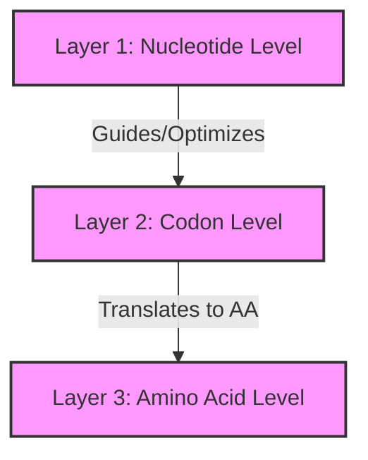

# Multi-Scale Genomics-LM: Architecture & Optimization Design

This document summarizes our conceptual design discussions regarding the transition of **Genomics-LM** from a codon-only model to a multi-scale biophysical architecture.

---

## 1. Context: Termination Motifs in CodonLM (Stage 2.5)

Our empirical testing of the Stage 2.5 model (`2026-06-06_stage2.5_6L4H_d256_e20`) using the newly created diagnostic scripts led to several critical insights:
1. **Current Limitations**: The current codon-level model has **not** learned to utilize or generate secondary mRNA structural motifs (GC-rich hairpins and poly-T tracts) as transcription termination cues. The model's termination behavior is purely stochastic.
2. **Root Causes**:
   * **Codon Smoothing**: 3-bp codon tokenization smooths over single-nucleotide base-pairing symmetries that are thermodynamically required to form stable stem-loop hairpins.
   * **Directional Causal Bias**: The model generates left-to-right. A transcription terminator resides in the 3' UTR *downstream* of the stop codon. The model must decide to output the Stop codon *before* it has generated the structural motifs that biologically signal termination.
   * **CDS-Centric Bias**: The training set is heavily skewed toward coding regions, neglecting the unique biophysics of intergenic/UTR spaces.

---

## 2. Multi-Scale Architectural Hierarchy

To address these limitations, we designed a three-layered multi-scale architecture:

1. **Layer 1 (Nucleotide Level)**: Captures fine-grained, frame-independent physical and thermodynamic motifs (promoters, operators, terminators, hairpins) using single-nucleotide resolution.
2. **Layer 2 (Codon Level)**: Captures the 3-periodicity grammar of genes, taxonomic dialects, and synonymous codon usage to generate valid protein-coding sequences.
3. **Layer 3 (Amino Acid Level)**: A multi-task Protein Critic (evaluating stability, Pfam family, and EC function) that evaluates generated sequences globally and rejects unstable candidates.

---

## 3. Integrating Nucleotides & Codons (Overcoming the 9x Memory Trap)

Moving to a nucleotide-level model increases sequence tokens by $3\times$, causing a **$9\times$ computational/memory overhead** in standard quadratic attention ($O(L^2)$). We discussed three integration strategies to maintain context window length under consumer hardware (8GB RAM):

### A. Dual-Track Late Fusion (Structural Compass)
* **Design**: A small, lightweight nucleotide-level encoder scans the sequence in local sliding windows (e.g., 60 bp) and computes continuous physical shape/energy vectors. These vectors are injected into the main codon-level generator at each step.
* **Overhead**: Very low (**10–15%** at inference time) because the heavy autoregressive generation is still performed at the codon level, and encoder states can be cached.
* **Benefit**: Guarantees structural directionality during codon generation without expanding sequence length.

### B. Hybrid Tokenization (Variable-Scale Tape)
* **Design**: A single model with a unified vocabulary containing both the 64 codons and the 4 single nucleotides. The dataset is tokenized at the codon level in coding regions (CDS) and at the single-nucleotide level in intergenic spaces/boundaries.
* **Benefit**: Achieves high-resolution physical modeling *only* where it matters (boundaries, terminators), while compressing 90% of the genome (coding regions) by $3\times$.

### C. Sliding-Window (Local) Attention
* **Design**: Instead of full quadratic attention, tokens only attend to a local neighborhood (e.g. 100 bp). 
* **Benefit**: Scales linearly ($O(L)$) and preserves the attention maps needed for mechanical interpretability, since secondary structures (like hairpins) are highly local features.

---

## 4. mRNA Optimization: Classical DP vs. Machine Learning

When translating a generated codon sequence into the optimal physical DNA/mRNA sequence (synonymous codon design), we compared two approaches:

### Classical Dynamic Programming
* **Method**: Viterbi-style trellis search over synonymous codons.
* **Performance**: Runs in $O(N)$ and is extremely fast.
* **Limitation**: RNA secondary folding involves long-range, nested base pairings that violate the Markov property, making global Minimum Free Energy (MFE) optimization **NP-hard**.

### Energy-Based Models (EBM)
* **Method**: Train a global, bidirectional model to assign low energy to stable structures.
* **Benefit**:
  * **Global Assessment**: Evaluates sequence stability non-causally (bidirectionally), capturing symmetric hairpin loops far better than left-to-right LMs.
  * **Direct Biophysics**: Maps probability directly to thermodynamics via the Boltzmann distribution ($P(x) \propto e^{-E(x)/kT}$), aligning the model's objective with folding free energy ($\Delta G$).
  * **Gradient Descent Design**: Allows Langevin dynamics / MCMC to perform gradient descent directly on the sequence space to lower its structural energy.
